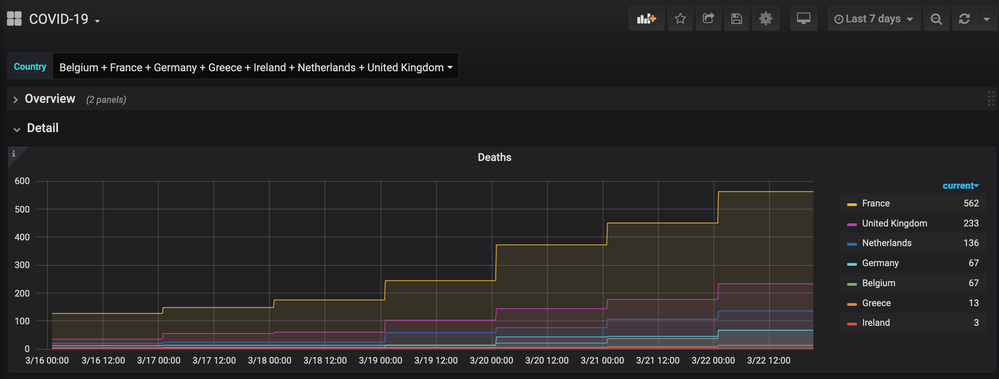

# Grafana - InfluxDB - COVID-19

## Intro
This project uses docker-compose and some custom scripting to create an InfluxDB and Grafana container.

Using the `refresh-data.sh` script, the latest data is pulled from Our World in Data website(https://ourworldindata.org/coronavirus-source-data).

## Howto

* Clone the repository.
```
git clone https://github.com/mboogert/covid-19.git
```

* Enter the repository directory.
```
cd covid-19
```

* Bring up the docker containers using docker-compose.
```
docker-compose up -d
```

* Download an insert the latest data.
```
sh refresh-data.sh
```

* Use your favourite browser and visit http://localhost:3000

* Enter the default username `admin` and password `admin`. After succesful logon you're prompted to change the password.

* Add a new InfluxDB datasource with the following details(http://localhost:3000/datasources/new).
> * URL: http://influxdb:8086
> * Database: covid-19

* Create a new dashboard using the JSON file in this repository(http://localhost:3000/dashboard/import).

* You should bow be able to see the most recent data plotted in your dashboard.

## Preview image

